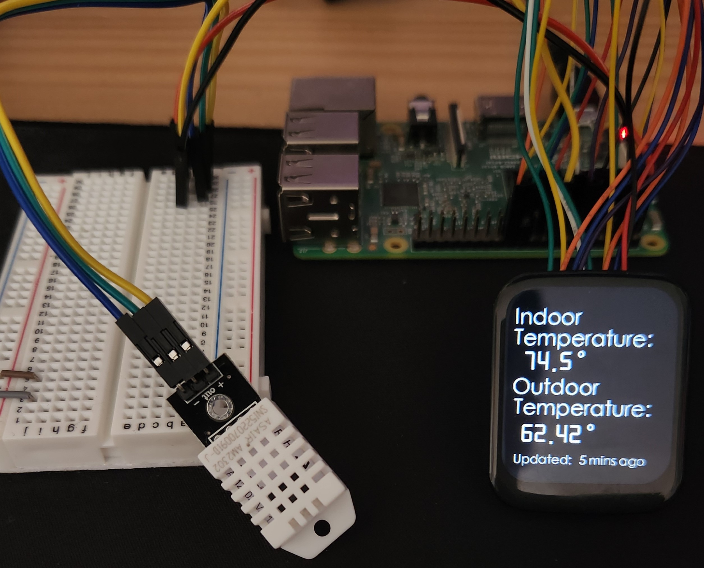

<h1>Raspberry Pi Thermostat</h1> 

  The Raspberry Pi grabs indoor and outdoor temperature data and displays it onto an touch screen LCD. 
   
  Indoor temmperature is measured using a DHT22 sensor, and the outdoor temperature is taken from 
  tomorrow.io's weather API.
   
  Still working on the housing.

<h2>Features</h2>
<ul>
  <li>Getures are used to perform certain actions. Swiping down shuts the screen off and a long press will wake the screen. Swiping right displays a second page (WIP)</li>
  <li>API is called 5 times per hour to ensure limit is not reached</li>
  <li>Room temperature is real-time, updating about once per second.</li>
  <li>Display shuts off after 100 seconds of inactivity</li>
  
</ul>

<h2>Components: </h2>
<ul>
<li>Raspberry Pi 3B</li>
<li>DHT22/AM2302</li>
<li>1.69in Touchscreen LCD</li>
</ul>

<h2>Previous builds</h2>
<h3>Pico + LCD </h3>

Issue: Pico does not have enough memory for API calls.

<h3>Pico + OLED </h3>

Issue: OLED was not touch screen and would require additional wiring to get interactivity.

<h3>Initial Prototype</h3>

Issue: No display to see temperatures. Mostly just a test to ensure the sensor was operating correctly. 

