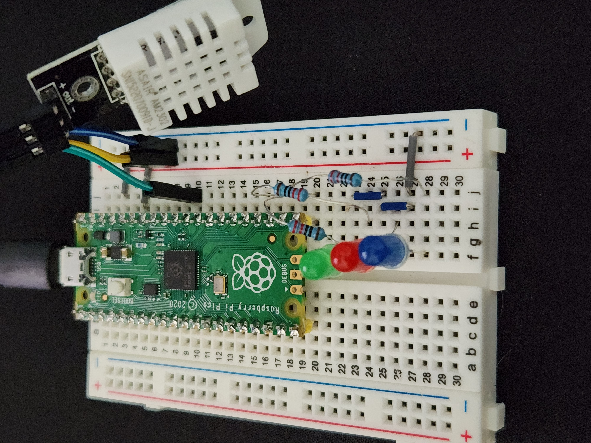

Raspberry Pi Pico powered Thermostat. Currently using LEDs to display status with plans to include a display as soon as it arrives in the mail.

Components:
- 1x Raspberry Pi Pico
- 1x DHT/AM2302
- 3x LEDs
- 3x 220 Ohm Resistors

