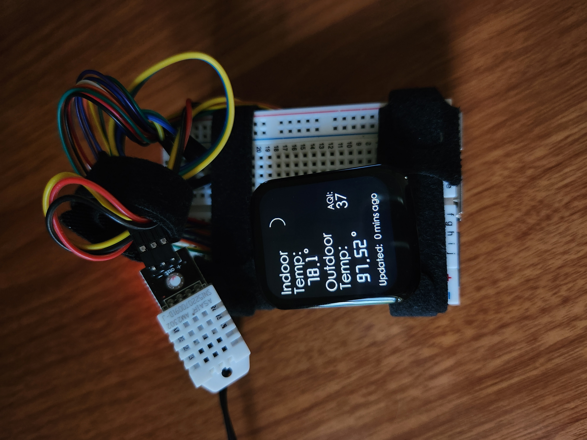
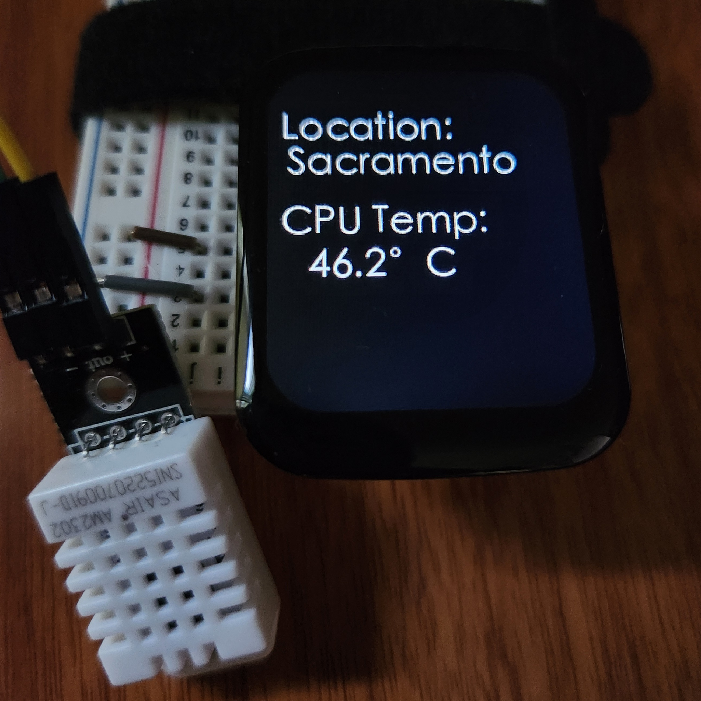
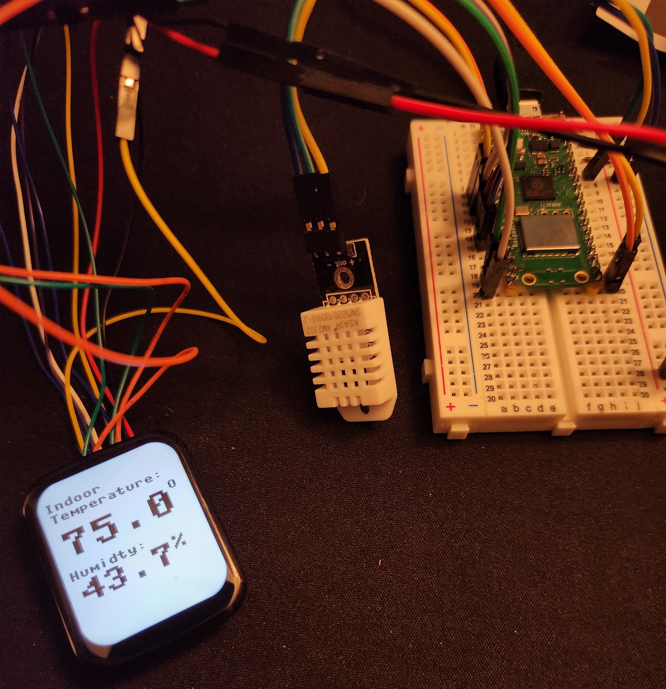

<h1>Raspberry Pi Thermostat</h1>

  The Raspberry Pi grabs indoor and outdoor temperature data and displays it onto a touch screen LCD. 
   
  Indoor temperature  is measured using a DHT22 sensor.
   
  Outdoor temperature is obtained through <a href="https://www.weatherbit.io/api/weather-current">weatherbit.io's weather API</a>.  
  Location is determined by using  <a href="https://ipregistry.co">ipregistry's geolocation api</a>, ensuring relevant weather data is shown to the user. 
   
  Still working on the housing.

<h2>Features</h2>
<ul>
  <li>Getures are used to perform certain actions. Swiping down shuts the screen off and a long press will wake the screen. Swiping right displays a second page</li>
  <li>Weather API is called 5 times per hour to ensure limit is not reached</li>
  <li>Room temperature is real-time, updating about once per second.</li>
  <li>Using IP address ensures weather data is always relevant to the user's location</li>
  <li>Second screen shows user location and CPU temp.</li>
  <li>Display shuts off after 100 seconds of inactivity</li>
  
</ul>

<h2>Components: </h2>
<ul>
<li>Raspberry Pi 3B</li>
<li>DHT22/AM2302</li>
<li>1.69in Touchscreen LCD</li>
</ul>

<h2>Previous builds</h2>
<h3>Pico + LCD Touchscreen </h3>

Issue: Pico does not have enough memory for API calls.

<h3>Pico + OLED </h3>

Issue: OLED was not touch screen and would require additional wiring to get interactivity.

<h3>Initial Prototype</h3>

Issue: No display to see temperatures. Mostly just a test to ensure the sensor was operating correctly. 

