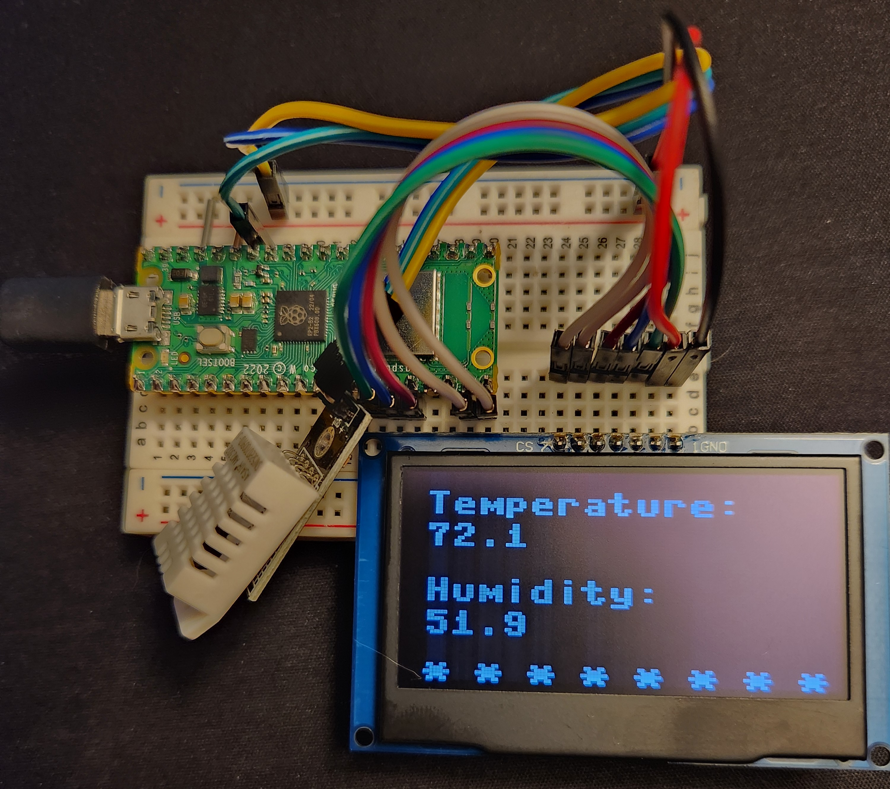

<h1>Raspberry Pi Pico powered Thermostat</h1> 

Pico grabs temperature and humidity data from the DHT22 sensor, and outputs the results to an OLED display.

Components:
- 1x Raspberry Pi Pico
- 1x DHT22/AM2302
- 1x SPI OLED 128x64 Display

<h2>Previous build without display</h2>

